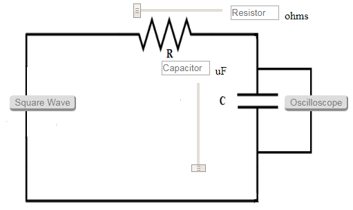
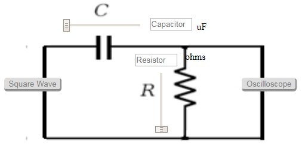
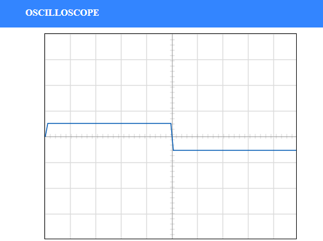

EMPTY

##  Procedure
### RC Integrator
- Set the resistance(R) and the capacitance (C) (Intially set R=10 kΩ and C=0.1 µF).
- Click on 'ON' button to start th experiment.
- Click on 'Square Wave' button to generate input waveform.
- Click on 'Oscilloscope' button to get the output waveform.
- Vary the Amplitude, Frequency, volt/div using the controllers.
- Click on "Dual" button to observe both the waveform.
- Channel 1 shows the input square waveform, Channel 2 shows the output waveform.
- At high frequencies the capacitor was not allowed to have enough time to charge or discharge fully, in this case thus we have the square wave as input signal which generates triangle waveform as output but with less amplitude.

***Figure 1***

### RC Differentiator
- Set the resistance(R) and the capacitance (C) (Intially set R=1 kΩ and C=0.1 µF).
- Click on 'ON' button to start th experiment.
- Select the Square Wave as input.
- Click on 'Oscilloscope' button, at high frequencies square wave input signal generates spike waveform output.
- Vary the Amplitude, Frequency, volt/div using the controllers.
- Click on "Dual" button to observe both the waveform.
- Channel 1 shows the input square waveform, Channel 2 shows the output waveform.

***Figure 2***

## Oscilloscope Tutorial  

An oscilloscope displays a voltage waveform versus time and has the following components:
- a screen to display a waveform,
- input jacks for connecting the signal to be displayed,
- dials to control how the signal will be displayed.

The screen is cathode ray tube found in most television sets where the face of the screen is divided up into a 2 dimensional grid (or axes or scale); In this experiment we consider 8x10 grid. The vertical grid is divided up into 8 (major) divisions and the horizontal grid is divided into 10 major divisions. To improve the precision, each of these divisions is further broken up into 5 minor divisions. The horizontal axis (X-axis) represents time and the vertical axis (Y-axis) represents voltage. The scope displays (also called a signal trace or trace) the input signal voltage along the vertical (or Y-axis) while an internally generated signal (called the horizontal sweep or sweep signal) is simultaneously produced along the X-axis creating a 2- dimensional time trace of the input signal.

***Figure 3***

***volts/div***- This control lets you change how many volts are represented by each vertical increment of grid (vertical axis) on the screen. Basically, it allows you to zoom in and out along the y axis.

***time/div***- This control lets you change how much time is represented by each horizontal increment of the grid overlay on the screen. It allows you to zoom in and out along the x axis.

If volt/div is set to 1 volt which implies each mazor vertical division is 1 volt where as each minor vertical division is 0.2 volt. And time/div is set to 0.1ms/div which implies each maor horiontal division is 0.1ms. Voltage on the vertical scale is 1 volt/div multiply by (number of division). Time on the horizontalscale is 0.1msec multiply by (number of division). In the figure 4, 1 volt/div and amplitude of the input signal is 1 volt. Here 0.1mses/div, the frequency is 1 kHz and its period is 1 complete cycle in 1m sec. 

***Figure 4***

In the figure 5, if volt/div is set to 2volt/div, which implies each mazor division is 2 volt where as each minor division is 0.5volt. 

***Figure 5***

Note: If you set the ***Volts/Div*** too low, you’ll clip the signal. Similarly, setting it too high, and you’ll won’t find the signal, i.e. the signal will b flat. ncreasing the Timebase will display more cycles of a periodic signal. Conversely, reducing the Timebase, fewer cycles will be displayed. 