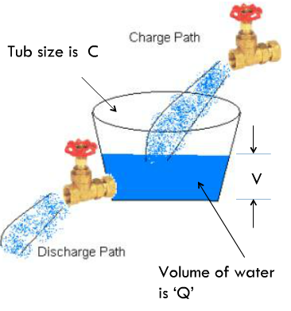
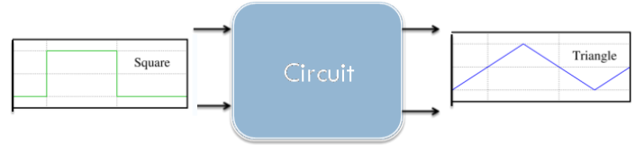
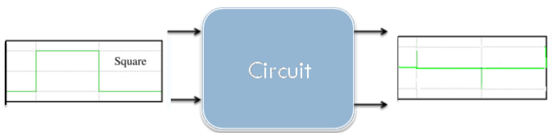
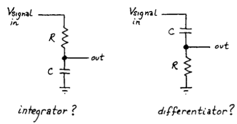
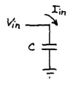
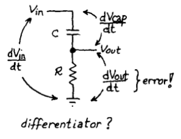

# Theory
## RC Circuit

### Time Domain Response
#### From Our Earliar Lessons

Capacitor helps us make circuit that 'remember’ their recent history.This ability allows us to make ‘timing’ circuit – circuits that let ‘this’ happen a predetermined time after ‘that’ occurs.

#### Mathematical Notation

- A static description of the way a capacitor bhaves would be to say Q=CV,where Qis the total charge,C is a measure of how big the capacitor is and V is the voltage across it.
- A dynamic description ,ie one that changes with time would be to say I=C dV/dt. This is just the time derivative of the static description . C is constant wrt time,I is the rate at which charge flow .This essentially says – the bigger the current , the faster the capacitor’s voltage changes.

#### Analogy

Think of Capacitor as a tub that can hold charge . A tub of large diameter( C), holds a lot of water ( Q ) for a given height( V). If you fill the tub within a thin straw ( small I) then water level – V- will rise slowly. If you use a large pipe(large V) then water level will rise faster. Similar for draining (discharging )tub. Of course a tub of larger diameter takes longer to fill than a tub of smaller diameter.

***Figure 1***

#### Charging With DC Source

The voltage across the capacitor approaches the applied voltage- but at a rate that diminishes towards zero as Vcap approaches the applied voltage . It starts out strongly charging at 10mA but as it is 1 V away it has slowed to 1/10 its rate.

***Figure 2***

#### Questions?

Does Vcap ever reach the applied Voltage of 10 V?

##### Charging With DC Source
  - In 1 time constant = RC , the capacitor charges 63% of the way
  - In 5 time constants = 5*RC, the capacitor charges 100% of the way
  - Vcap never reaches Vapplies

***Figure 3***

##### Discharging With DC Source
  - Discharging follows similar principles to charging
  - In 1 time constant = RC , the capacitor discharges 63% of the way
  - In 5 time constants = 5*RC, the capacitor charges 100% of the way

***Figure 4***

##### Exploratory – Charging With DC Source
  -  How would the graph change if keeping C constant R is decreased?
  -  Will the rate of change of voltage increase or decrease?
  -  How will the time constant(RC) change?
  -  Decreasing R would increase current , thus would increase dV/dt=I/C.
  -  Rate of change of voltage would increase.
  -  Time constant (RC) would decrease , so it will charge faster.
  -  How would the graph change if keeping R constant C is increased?
  -  Will the rate of change of voltage increase or decrease?
  -  How will the time constant( RC) change?

***Figure 5***

##### Square Wave Response Of RC Circuit

After studying how a constant sourc affects the charging-discharging of a RC , circuit , let us change the constant source to a source which changes very fast and observe the response of an RC Circuit.

We want to study the transient behaviour of the RC circuit when we suddenly change the voltage across the circuit . In order to do this we generate a square wave and observe the response of the voltage across the capacitor using an oscilloscope.

##### Characteristics Of A Square Wave

In the laboratory ,you will not study the response of an RC circuit to a single voltage step or voltage poulse , rather you will study the response to a periodic square wave with the waveform illustrated below-

***Figure 6***

The pulse goes from - V to +V and has a period T. What is the response of the RC circuit to this period square wave?

##### Square Wave Response – Slow Change

Since we have seen that a time of 5T where T=R*C is needed for the capacitor to change fully , let us first take a time period of the square wave large enough to charge the capacitor. So,we take Time Period of Square wave >>RC . So in effect , this square wave is changing slowly.

##### Important Observations

These experiments were done in the time domain. However in this frequency domain a signal which changes fast would mean it’s high frequency signal ( or it has frequency components ), a signal which changes slowly would mean it has low frequency components and a signal which does not change very fast has medium frequency components. Clearly we saw the following response of RC circuit for the different frequencies as-

***Figure 7***

#### Integrators And Differentiators

##### What Is Integrator?

***Figure 8***

The Integrator is a circuit that converts or ‘integrates' a square wave input signal into triangular waveform output.

##### What Is Differentiator?

***Figure 9***

The Differentiator circuit converts or 'differentiates' a square wave input signal into high frequency spikes at its output.

##### RC As Integrators And Differentiator ?

***Figure 10***

Can we exploit capacitor I=Cdv/dt to make differentiator and integrator?

#### RC Circuits As Differentiator

##### Basic Differentiation

***Figure 11***

Consider this circuit – the current that flows in the capacitor is proportional to dV/dt – ie, the circuit differentiates the input signal . But – we really can’t measure the current here. Let us try to do that.

***Figure 12***

So, we put a resistor to measure the current but choose a very small resistor so that there will be very small voltage drop such that dVcap/dt ≈ dVin/dt .

#### RC As Differentiator

In an RC circuit if we take the voltage drop across R, and if we keep RC time constant is very short compared to the time period of the input waveform we will be differentiating the square wave.

***Figure 13***

#### RC Circuit As Integrator

##### We Understand – Integrator

***Figure 14***

The Integrator is a circuit that converts or ‘integrates a square wave input signal into triangular waveform output.

##### Simple Integrator 

***Figure 15***

Consider this simple circuit – if we had a constant current source that flows in the capacitor, dVcap/dt – would be constant and we would have a ramp.

***Figure 16***

To generate a triangle wave – we can simply have the following setup .But of course – constant current sources are rare. So, how can we have this with a square wave generator?

##### RC As Integrator

***Figure 17***

So, we put a resistor such that we can control the current and ideally try to have dVout/dt to be a constant. Since the current does not change much during the initial part of the charging and discharging of the capacitor , the value of RC must be chosen such that it is large compared to the time period of the square wave.